# Fish Direction & Pose Pipeline

Estimate a fish's **swimming direction** (8 compass classes + "no fish") and
**pose** (regular / upside-down) from underwater video frames.

The pipeline is four stages backed by two trained models:

```
video        ──▶ [phase 0] ffmpeg frame extraction   ──▶ PNG frames
PNG frames   ──▶ [phase 1] YOLOv8 fish detector      ──▶ fish crops (ROIs)
fish crops   ──▶ [phase 2] multi-task ViT classifier ──▶ per-crop prediction JSON
predictions  ──▶ [phase 3] aggregate report          ──▶ summary.json / summary.txt
```

`run_pipeline_gui.py` runs all four from a single window: browse to a video,
pick a sampling frame rate, watch it run
(see [appendix 5](#5-pipeline-gui-results-tab)).

---

## Repository structure

```
full_pipeline/
├── run_pipeline_gui.py              ← start here: GUI for the whole pipeline
├── config.py                        ← every path + shared constant
├── torch_device.py                  ← CUDA / MPS / CPU device selection
├── requirements.txt
│
├── phase0_frame_extraction/
│   └── extract_frames.py            video  → PNG frames        (ffmpeg)
├── phase1_fish_detection/
│   ├── detect_and_crop_rois.py      frames → fish crops        (YOLOv8)
│   └── weights/yolo_fish_detector_v2.pt
├── phase2_direction_pose_inference/
│   ├── run_classifier.py            crops  → prediction JSONs  (ViT)
│   └── weights/best_model_v7.pt
├── phase3_analysis/
│   ├── summarize_predictions.py     JSONs  → summary.json/.txt
│   └── charts.py                    summary → charts/*.png
│
├── model_training/
│   ├── fish_detector/
│   │   ├── train_yolo.py            train the YOLOv8 detector
│   │   └── data.yaml.example        template Ultralytics dataset file
│   └── direction_classifier/
│       ├── build_manifest.py        labels    → manifest.csv
│       ├── split_dataset.py         manifest  → splits/{train,val,test}.csv
│       ├── dataset.py               shared torch Dataset (not a CLI)
│       ├── train.py                 splits    → best_model_v7.pt
│       └── training_log.txt         log of the bundled checkpoint's run
│
├── data_labeling/
│   ├── direction_pose_gui.py        label crops: direction + pose
│   ├── pose_correct_gui.py          audit an already-sorted pose folder
│   └── analyze_labels.py            distribution + validity of a label set
│
├── dataset_ops/
│   ├── sort_crops_by_class.py       ROI crops → per-class folders
│   ├── select_best_crops.py         rank crops by quality, keep the top N
│   ├── background_match_filter.py   re-tune the phase-1 background threshold
│   ├── folder_complement.py         SOURCE minus SUBTRACT
│   ├── extract_face_tail_classes.py drop Face(9)/Tail(10) → the 9-class set
│   ├── extract_no_fish.py           pull "No Fish" samples out for re-review
│   └── extract_invalid_labels.py    pull rule-breaking (direction, pose) pairs
│
├── evaluation/
│   ├── validation_error_analysis.py confusion matrices on the labelled split
│   ├── review_predictions_gui.py    manually score a run on unseen video
│   ├── review_analysis.py           turn those reviews into accuracy numbers
│   └── check_batches.py             find batches with zero valid pose labels
│
└── appendix_photos/                 screenshots + result charts (see Appendix)
```

Everything outside `phase0`–`phase3` (model training, labeling, dataset
surgery, evaluation, review GUIs) supports *building* the two models and is
**not** part of the runtime inference path.

---

## Setup

```bash
python3 -m venv .venv
source .venv/bin/activate            # Windows: .venv\Scripts\activate
pip install -r requirements.txt
```

Also needed outside pip:

- **ffmpeg / ffprobe** on `PATH` (phase 0) — `brew install ffmpeg` /
  `sudo apt install ffmpeg` / <https://ffmpeg.org>. Or set `FFMPEG_BIN` /
  `FFPROBE_BIN`.
- **Tkinter** for the GUIs — bundled with the python.org installers; on Ubuntu
  `sudo apt install python3-tk`.

For a specific CUDA build of PyTorch, install `torch`/`torchvision` first per
<https://pytorch.org/get-started/locally/>, then `pip install -r requirements.txt`.

### Device (GPU) selection

`torch_device.py` picks the best backend automatically: **CUDA** (NVIDIA) →
**MPS** (Apple-Silicon GPU) → **CPU**. The original training ran on a
Windows/CUDA box; on this Mac the GPU is Metal/`mps`, which
`torch.cuda.is_available()` never reports — that's why phases 1-2 previously ran
on CPU. Both the YOLO detector and the ViT now use `select_device()`.

The GUI shows the active device in bold and prints it per phase. Unsupported
MPS ops fall back to CPU automatically (`PYTORCH_ENABLE_MPS_FALLBACK=1`, set in
`config.py`). To force CPU, call `select_device(prefer="cpu")`.

Quick check that MPS is visible to your interpreter:

```bash
python -c "import torch; print(torch.backends.mps.is_available())"
```

---

## Configuring paths

Code lives in this repo; the image/label/prediction folders are large and live
outside it. Point the pipeline at your data with one environment variable:

```bash
export FISH_PIPELINE_DATA=/path/to/deep_learning_data      # macOS / Linux
set    FISH_PIPELINE_DATA=D:\deep_learning_data            # Windows
```

If unset, everything defaults to `full_pipeline/data/`. Expected layout under
`FISH_PIPELINE_DATA` (see `config.py` for the full list):

```
frames/                     PNG frames              (phase 0 output → phase 1 input)
rois/                       fish crops              (phase 1 output → phase 2 input)
predictions/                prediction JSON         (phase 2 output)
summary.json / summary.txt  aggregate report        (phase 3 output)
charts/*.png                result pie charts       (phase 3 output)
labels/                     manual label JSONs
trainset/
    images/  labels/        crops + labels for ViT training
    manifest.csv  splits/   built by model_training/direction_classifier/
vit_fish_output/            training checkpoints / logs
runs/<name>_<timestamp>/    one self-contained folder per GUI run (all of the above)
```

`ffmpeg` and `ffprobe` must be on `PATH` for phase 0 (or set `FFMPEG_BIN` /
`FFPROBE_BIN`).

The trained weights are bundled in the repo:
`phase1_fish_detection/weights/yolo_fish_detector_v2.pt` and
`phase2_direction_pose_inference/weights/best_model_v7.pt` (tracked with
**Git LFS** — see `.gitattributes` — because the second file is ~330MB, over
GitHub's 100MB per-file limit without it; run `git lfs install` once before
cloning/pushing if you haven't already).

**No script has a hardcoded personal path, and no script needs a source edit
to be pointed somewhere else.** Every script resolves its paths from
`config.py`, which in turn resolves from `FISH_PIPELINE_DATA` — so relocating
your entire data tree is a single environment variable. On top of that, every
runnable script accepts `--flag` overrides for its own inputs, outputs and
tuning parameters, so a one-off run never has to touch the env var either. Run
any of them with `--help` to see the flags and their resolved defaults:

```bash
python model_training/direction_classifier/train.py --help
```

The only two files without a command line are `phase3_analysis/charts.py` and
`model_training/direction_classifier/dataset.py`. Neither is an entry point:
they are library modules imported by `summarize_predictions.py` and by
`train.py` / `validation_error_analysis.py` respectively, and they take their
folders as function arguments from whichever script imported them — which is
how those scripts' `--images` / `--splits-dir` flags reach them.

---

## Running the inference pipeline

Easiest: `python run_pipeline_gui.py`.

1. **Start from** — pick the phase to begin at (0 video · 1 frames folder ·
   2 ROI-crops folder · 3 predictions folder).
2. **Browse…** — one button; the dialog matches the chosen start phase.
3. For a video, pick a sampling fps (the GUI shows the estimated frame count and
   a recommended value).
4. **Run pipeline** — the remaining phases run in order.

Every run writes to its own timestamped folder,
`<data root>/runs/<name>_<YYYYmmdd-HHMMSS>/`, so repeated runs never overwrite.

- **One overall progress bar** with **tick marks at each phase boundary** and the
  phase name on each segment. It's weighted by phase and driven by sub-step
  events the scripts emit: ffmpeg frame count, model loading, per-frame
  detection, per-batch classification, chart rendering.
- The line under the bar shows the current sub-step with a **live rate and ETA**
  (e.g. `classifying 2000/4000 · 46/s · ETA 0m43s`).
- The active **device** (CUDA / MPS / CPU) is shown in bold and per phase.
- **Results tab** — the phase-3 pie charts (fish vs no-fish, direction
  distribution, pose, upside-down by direction) plus the text summary, with an
  "Open results folder" button.
- **Sort crops tab** — runs `dataset_ops/sort_crops_by_class.py` on a finished
  run: pick the run folder and it sorts the ROI crops into per-class /
  per-direction folders, splitting `upside_down/` into `high_conf/` and
  `low_conf/` for review.

Or run the stages by hand:

```bash
# Phase 0 — video → PNG frames at a chosen sampling rate
python phase0_frame_extraction/extract_frames.py --video clip.mp4 --fps 5
python phase0_frame_extraction/extract_frames.py --video clip.mp4 --probe   # info only

# Phase 1 — detect fish and crop ROIs
python phase1_fish_detection/detect_and_crop_rois.py
#   defaults: --input $DATA/frames  --output $DATA/rois  --weights <bundled>

# Phase 2 — classify direction + pose, write one JSON per crop
python phase2_direction_pose_inference/run_classifier.py
#   defaults: --images $DATA/rois  --output $DATA/predictions  --weights <bundled>

# Phase 3 — aggregate report + pie charts
python phase3_analysis/summarize_predictions.py
#   defaults: --predictions $DATA/predictions  --charts-dir $DATA/charts
```

Each phase-2 JSON is one crop's prediction — `direction` / `direction_name` /
`direction_confidence`, `no_fish_confidence`, and `pose` / `pose_name` /
`pose_confidence` (pose is `null` for No Fish / N / S). No accept/reject gate.

Phase 3 aggregates those into `summary.txt` / `summary.json` plus `charts/*.png`
(pie charts): crop and no-fish counts, the direction distribution over fish
crops, and the pose breakdown.

For pose, an "Upside Down" call is only counted as upside-down when the pose
head's confidence is at least `config.UPSIDE_DOWN_CONF_THRESHOLD`; weaker calls
are folded into "Regular". On an unseen test video the confident calls were
almost all truly upside-down and the low-confidence ones almost all regular. The
report keeps the raw pose-head counts too, a confidence histogram of every raw
upside-down call, the per-direction upside-down rate, and the list of frames
that contain a confirmed upside-down fish (the review shortlist).

---

## Reproducing the models

### Fish detector (YOLOv8)

```bash
cp model_training/fish_detector/data.yaml.example model_training/fish_detector/data.yaml
#   edit data.yaml to point at your YOLO dataset
python model_training/fish_detector/train_yolo.py
#   or: --data /other/data.yaml --imgsz 1024 --batch 8 --epochs 300 --device 0
```

Weights land in Ultralytics' own `runs/` folder; the path is printed at the
end. Copy the resulting `best.pt` into `phase1_fish_detection/weights/` (or
pass it to phase 1 with `--weights`) to actually use it.

`--imgsz` matters here: frames are 1920×1080 and a fish is ~60 px, so 640
shrinks it to ~20 px. 1280 keeps it at ~40 px — and inference must run at the
same `imgsz`.

### Direction / pose classifier (ViT)

Run in order:

```bash
python model_training/direction_classifier/build_manifest.py   # trainset/labels → manifest.csv
python model_training/direction_classifier/split_dataset.py    # manifest.csv → splits/{train,val,test}.csv
python model_training/direction_classifier/train.py            # → vit_fish_output/best_model_v7.pt
```

Each accepts flags (`--images`, `--labels`, `--output`, `--manifest`,
`--splits-dir`, `--output-dir`, `--batch-size`, `--epochs`, `--patience`,
`--learning-rate`, `--weight-decay`, `--pose-weights`); `--help` lists them
with their resolved defaults. Drop `--batch-size` to 16–32 on a GPU smaller
than 8 GB.

**`build_manifest.py`** converts the raw label values into training targets.
Raw pose `0 / 1 / 2` (N/A / Regular / Upside Down) becomes `-100 / 0 / 1`,
where `-100` is torch's `ignore_index`: that is how crops whose direction makes
pose meaningless (No Fish / N / S) are excluded from the pose loss without
being dropped from direction training. It also parses a `frame_id` out of each
filename, which is what the next step groups on.

**`split_dataset.py`** splits by *temporal chunk*, not by row. Consecutive
video frames are nearly identical, so a random per-crop split would put
near-copies of the same fish in both train and test and report an accuracy the
model does not have. Frames are grouped into blocks of `CHUNK_SIZE_FRAMES` and
whole chunks are assigned to a split. Because upside-down fish are rare *and*
clustered in time, a random chunk assignment easily starves val or test of
them, so the script searches many assignments and keeps the one closest to
70/15/15 that still meets the `MIN_UPSIDE_*` floors. It is seeded, so re-running
reproduces the same three CSVs.

**`dataset.py`** is the shared dataset module (imported by `train.py` and
`validation_error_analysis.py`); it is not run directly. It applies a
**horizontal-flip** augmentation on the training split only, mirroring the
direction label (E↔W / NE↔NW / SE↔SW; pose unchanged). Vertical flip is
deliberately not used — see *What we tried* below. Running the file directly
performs a sanity check: it builds the three splits and prints one sample.

Training results for the bundled checkpoint (`best_model_v7.pt`) are in
`model_training/direction_classifier/training_log.txt`
(best epoch 18, val loss 0.42, test direction acc 88% / macro F1 0.83,
pose macro F1 0.97).

---

## Supporting tools

Every one of these takes `--help`.

### Labeling (`data_labeling/`)

| Script | Purpose |
|---|---|
| `direction_pose_gui.py` | Label crops with direction + pose, one JSON per crop ([appendix 10](#10-labeling-gui)). Pass `--images` to skip the folder dialog and `--labels` to redirect the output; otherwise labels go to a `labels/` folder beside the images. Crops that already have a label are never shown again, so a session is resumable. |
| `analyze_labels.py` | Class distribution + validity report for a label folder (`--labels`). Prints the direction distribution, both pose distributions, the direction × pose cross-tab, and every malformed file, out-of-range value and rule-breaking (direction, pose) pair. |
| `pose_correct_gui.py` | Audit an already-sorted pose folder — step through e.g. `upside_down/high_conf/` and mark each crop's pose call correct or false. Useful for sanity-checking `UPSIDE_DOWN_CONF_THRESHOLD` on a new video. |

### Dataset surgery (`dataset_ops/`)

| Script | Purpose |
|---|---|
| `sort_crops_by_class.py` | Sort ROI crops into `no_fish/`, `regular/<DIR>/`, `upside_down/{high,low}_conf/<DIR>/` and `pose_not_applicable/{N,S}/` folders using the phase-2 predictions ([appendix 7–9](#sorted-crop-folders)). `upside_down/` splits at `--upside-conf-threshold`. Flags: `--move`, `--flat`, `--use-raw-pose`, `--no-upside-conf-split`. Also the **"Sort crops" tab** in the GUI. |
| `select_best_crops.py` | Rank crops by sharpness/exposure/contrast, drop exact duplicates (SHA-256) and anything visually close to `--exclude-similar-to` references, and copy the top `--top-n` plus a CSV of scores. Used to narrow a raw ROI dump down to a labelling batch. `--input`/`--output` are required. |
| `background_match_filter.py` | Re-apply the phase-1 static-background rejection at a different threshold **without re-running YOLO**, by replaying the `match_pct` column phase 1 already logged in `boxes.csv`. `--hist` prints the match-percentage histogram so you can see the valley between fish and background and pick a threshold. |
| `folder_complement.py` | Copy `SOURCE` minus every filename present in `SUBTRACT`, e.g. "all crops except the 5000 already labelled". |
| `extract_face_tail_classes.py` | Drop Face(9)/Tail(10) samples → the 9-class set the ViT is trained on. |
| `extract_no_fish.py` | Pull "No Fish" (direction 0) samples out for re-review. |
| `extract_invalid_labels.py` | Pull samples whose (direction, pose) pair breaks the labeling rules. |

### Evaluation (`evaluation/`)

| Script | Purpose |
|---|---|
| `validation_error_analysis.py` | Confusion matrices + copies of every misclassified crop, against the held-out **validation split** — so it needs ground-truth labels. Writes `validation_predictions.csv`, both confusion matrices and `direction_errors/` + `pose_errors/`. Flags: `--weights`, `--images`, `--splits-dir`, `--output-dir`, `--batch-size`. The output folder is wiped on each run. |
| `review_predictions_gui.py` | Manually score a full pipeline **run** on unseen video, where there is no ground truth ([appendix 11](#11-prediction-review-gui)) — see below. |
| `review_analysis.py` | Turn that GUI's saved reviews into accuracy numbers — see below. |
| `check_batches.py` | Flag batches in a split CSV that contain zero usable pose labels. The pose head uses `ignore_index=-100`; an all-ignored batch yields a NaN pose loss, and this confirms or rules that out. Pass the same `--batch-size` the training run used, or the report means nothing. |

### `evaluation/review_predictions_gui.py` — manual review of a full run

Unlike `validation_error_analysis.py` (which needs an already-labeled split),
this reviews a **fresh, unlabeled run's** actual output crop by crop, so you can
score the pipeline end-to-end on unseen video. It covers both classified crops
(`rois/`) *and* crops the phase-1 background filter discarded before they ever
reached the classifier (`rois_ignored_background/`), since a fish the filter
wrongly threw away is otherwise invisible to every other metric.

```bash
# default: pooled random sampling across the whole run
python evaluation/review_predictions_gui.py --run /path/to/run

# class-stratified sampling: pick a random per-class folder first (from
# dataset_ops/sort_crops_by_class.py output), then a random image inside it,
# so rare classes get reviewed as often as the majority class
python evaluation/review_predictions_gui.py --run /path/to/run --split-dir
python evaluation/review_predictions_gui.py --run /path/to/run \
    --split-dir /path/to/run/sorted_by_class_0.85
```

`--run` is the folder holding `rois/`, `predictions/` and `boxes.csv`; it
defaults to the `config.py` data root, so `FISH_PIPELINE_DATA=/path/to/run`
works just as well.

Review controls: `V`/`A`/`X` score direction (correct / 45°-off / wrong); `P`
flags a correct direction with a wrong pose call, `D` the reverse; `F`/`N` are
presence-only (fish / no fish); `U` undoes the last review. Reviews are written
to `<run>/reviews/*.json`, one file per crop, and a running
`<run>/review_summary.json` is kept up to date after every review — safe to
stop and resume across sessions, and safe to mix `--split-dir` and default runs
on the same `reviews/` folder (a crop reviewed once is never shown again in
either mode).

### `evaluation/review_analysis.py` — turn those reviews into numbers

Reads every file in `<run>/reviews/` and reports: how many crops landed in the
correct class (a `V` review) vs. not, broken down by what actually went wrong;
the background filter's own false-negative rate; and — specifically for the
pose head's `UPSIDE_DOWN_CONF_THRESHOLD` gate — how many low-confidence
"Upside Down" calls it correctly downgraded to "Regular" vs. wrongly buried,
plus a sweep showing what would happen at other threshold values on the same
reviewed ground truth. Re-run any time after reviewing more crops; it always
reads the full current set.

```bash
python evaluation/review_analysis.py --reviews-dir /path/to/run/reviews
python evaluation/review_analysis.py --reviews-dir /path/to/run/reviews \
    --thresholds 0.5,0.6,0.7,0.8,0.9
python evaluation/review_analysis.py --reviews-dir /path/to/run/reviews \
    --out-json results.json
```

---

## What we tried

- **Direction-confidence gating (dropped).** An earlier build reported, and at
  one point down-weighted, predictions with `direction_confidence` below 0.60.
  It conflated three unrelated things — "not a fish", "genuinely hard pose", and
  head-on N/S fish (which are inherently low-confidence) — so it was removed.
  Nothing is gated on direction confidence now; the raw confidence is still in
  every prediction JSON if you want to filter downstream.
- **Vertical-flip augmentation for the pose head (failed).** To synthesise
  upside-down training crops we flipped whole crops top-to-bottom and inverted
  the pose label. That also inverts the scene's top-to-bottom lighting gradient,
  so the model learned "inverted lighting ⇒ upside-down" instead of body
  orientation: test metrics looked excellent but real inference got worse. It
  was replaced with real mined upside-down crops plus **horizontal-flip only**
  (lighting-safe).
- **Pose head, current state.** Even the v7 model over-predicts upside-down for
  fish seen at oblique angles at this video resolution, where belly-up vs
  belly-down is barely visible. The practical mitigation is
  `UPSIDE_DOWN_CONF_THRESHOLD`: confident calls are reliable, low-confidence
  calls are counted as regular and can be eyeballed in the sort tool's
  `upside_down/low_conf/` folder.
- **Static-background rejection (kept).** Tank decorations that pass YOLO are
  rejected by comparing each detection box to a per-video median-background
  image (`BACKGROUND_MATCH_THRESHOLD`, `BACKGROUND_SAMPLE_FRAMES`).

## Notes

- `phase6`–`phase8` in the old layout were empty and were removed.
- Training data and past training bundles live in `../pipeline_archive/`, not in
  this tree.
- **This folder ships code, trained weights and `appendix_photos/` only.** No
  videos, no frame/ROI/prediction data, no `.venv/`. Create a venv from `requirements.txt` and point
  `FISH_PIPELINE_DATA` at your own data folder (or just run the GUI on a video —
  it makes `data/runs/<name>_<timestamp>/` for you).
- `phase2_direction_pose_inference/weights/best_model_v7.pt` is the
  inference-only checkpoint (~350 MB: model weights + metadata, no optimizer
  state). The full training checkpoint is archived separately.

---

## Appendix — screenshots and results

All images live in `appendix_photos/`. The charts and sorted-crop folders come
from one run of the demo aquarium video (4177 crops from 822 sampled frames).

### Phase-3 result charts

These four PNGs are exactly what `phase3_analysis/charts.py` writes into
`<run>/charts/`, and what the GUI's **Results** tab displays.

#### 1. Fish vs no fish

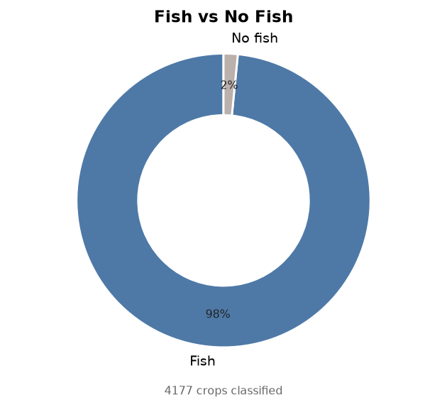

Of 4177 crops the detector handed to the classifier, 98% were confirmed as fish
and 2% were rejected by the ViT's No Fish class. This is the pipeline's own
second opinion on YOLO: a low no-fish share means the detector and the
background filter are not flooding the classifier with coral and equipment.

#### 2. Swimming direction

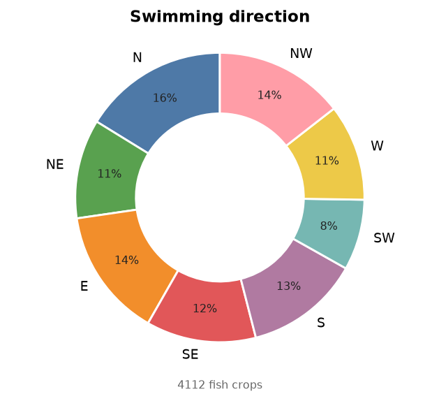

The headline result — the direction distribution over the 4112 fish crops. It
is close to uniform, as expected for fish milling around a tank with no
current; the N/S share (16% + 13%) is the fraction swimming toward or away from
the camera, where no left/right component is visible.

#### 3. Pose

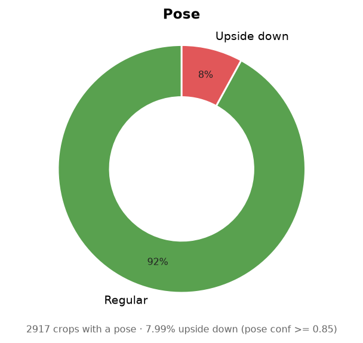

Pose over the 2917 crops where pose is defined at all (N, S and No Fish are
excluded — a head-on fish shows no belly). 7.99% were confidently upside down
at `UPSIDE_DOWN_CONF_THRESHOLD = 0.85`; everything below that gate is counted
as Regular, which is why the subtitle names the threshold.

#### 4. Upside-down fish by direction

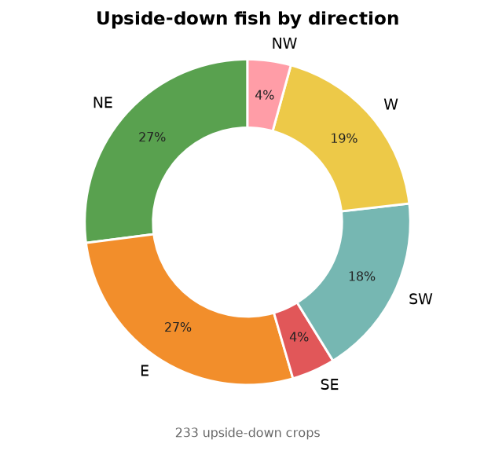

How the 233 confirmed upside-down crops break down by swimming direction. This
is a diagnostic as much as a result: a genuinely sick fish appears across
directions, whereas a heavy skew toward one or two directions suggests the pose
head is keying on viewing angle rather than body orientation. Here the mass
sits on the four oblique/lateral classes (NE, E, W, SW), which is where the
belly is actually visible.

### 5. Pipeline GUI, Results tab

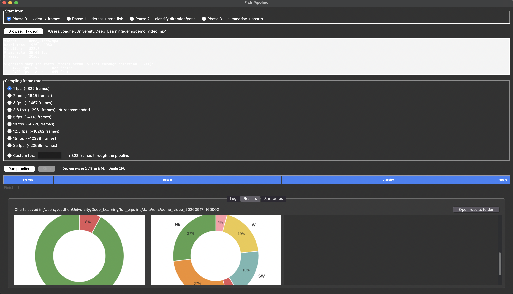

`run_pipeline_gui.py` after a finished run. Visible: the **Start from** phase
selector; the ffprobe readout of the chosen video (1920×1080, 822.6 s, 25 fps,
20565 frames); the **sampling frame rate** list with the recommended 3.6 fps
starred — each option shows how many frames it would actually push through
detection and classification; the active device (*phase 2 ViT on MPS — Apple
GPU*); and the segmented progress bar with one tick-marked, phase-weighted
segment per phase (Frames · Detect · Classify · Report). The **Results** tab
below shows the phase-3 charts inline with an "Open results folder" button.

### 6. Median background vs. a real frame

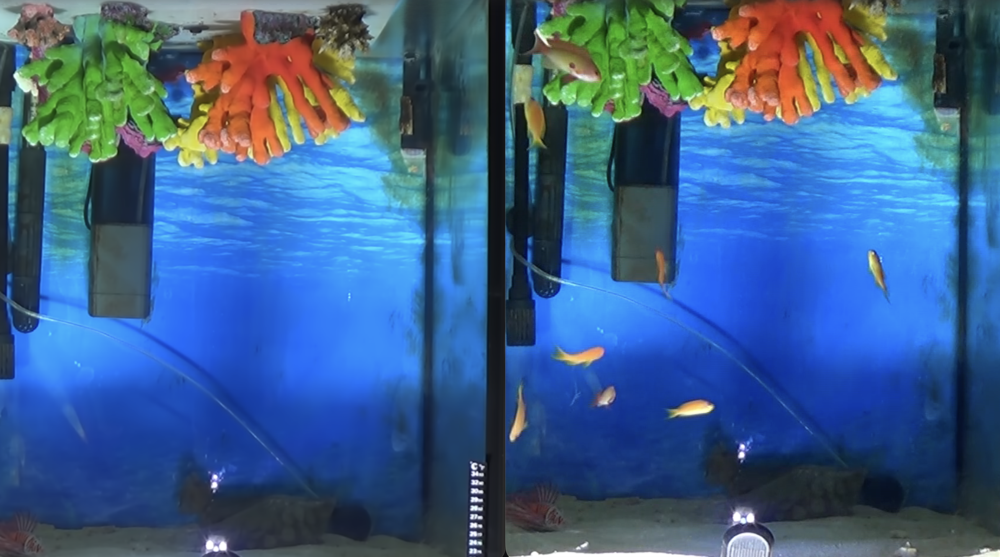

What the phase-1 static-background rejection is built on. **Left:** the median
image over an even sample of `BACKGROUND_SAMPLE_FRAMES` frames — the corals,
filter, air line and thermometer survive the median because they never move,
while every fish averages away completely. **Right:** one real frame from the
same video. Each YOLO box is compared against the same box cut from the left
image; a box that matches it closely is a decoration, not a fish, and is
diverted to `rois_ignored_background/`.

### Sorted crop folders

The three screenshots below are `dataset_ops/sort_crops_by_class.py` output for
the same run — the fastest way to eyeball whether a class is actually coherent.

#### 7. `regular/NE/`

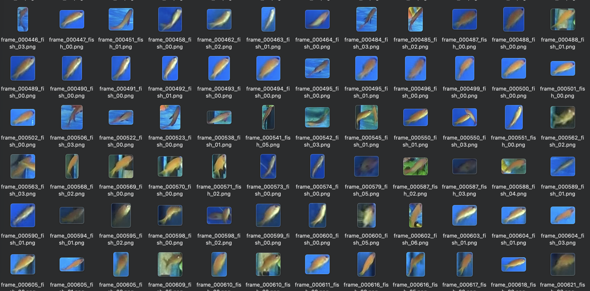

Crops the model called north-east with a regular (belly-down) pose. The class is
visually consistent: every fish is angled up-and-right, and every one is
belly-down.

#### 8. `pose_not_applicable/S/`

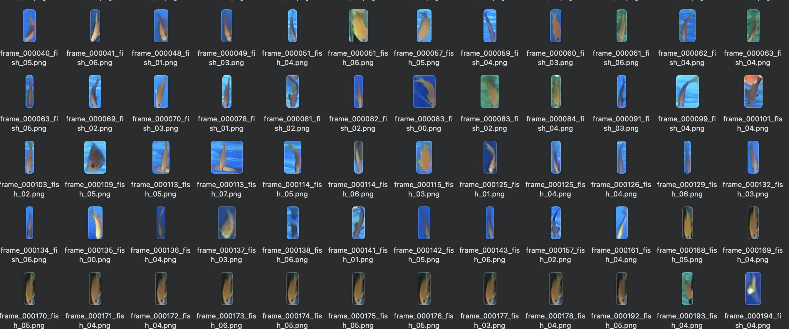

Crops called south — swimming toward the camera. Note how tall and narrow the
boxes are: a fish pointed at the lens is foreshortened to almost nothing
horizontally. This is also exactly why pose is undefined here, and why N and S
land in `pose_not_applicable/` rather than `regular/` or `upside_down/` — with
the belly hidden, belly-up and belly-down are indistinguishable.

#### 9. `upside_down/high_conf/E/`

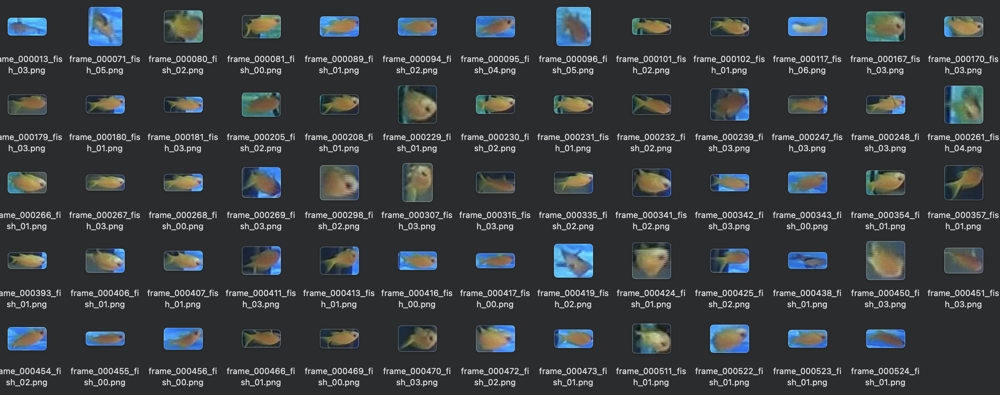

Crops the pose head called upside down at or above the 0.85 confidence gate,
for fish swimming east. Sorting the confident calls into their own folder like
this is how the threshold was validated: at `high_conf` the calls are nearly all
genuinely belly-up, while the `low_conf/` sibling folder is nearly all ordinary
fish — which is what justifies folding the low-confidence calls back into
"Regular" for the headline numbers.

### 10. Labeling GUI

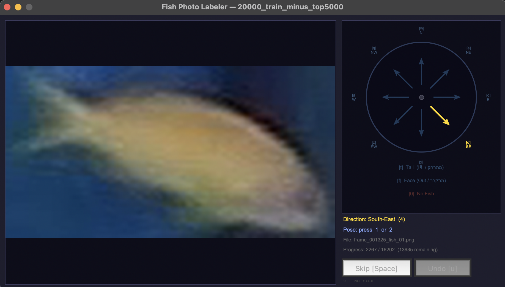

`data_labeling/direction_pose_gui.py` mid-session. The crop fills the left
pane; the right pane is the compass with each direction's keyboard shortcut in
brackets (`q`/`w`/`e` · `a`/`d` · `z`/`x`/`c`), plus Tail `[t]`, Face `[f]` and
No Fish `[0]`. Here South-East has been chosen — the compass arrow confirms the
selection — and the GUI is waiting for the pose key (`1` Regular / `2` Upside
Down). N, S and No Fish skip that second keypress and auto-save with pose = N/A.
The progress line shows 2267 / 16202 labelled with 13935 remaining.

### 11. Prediction review GUI

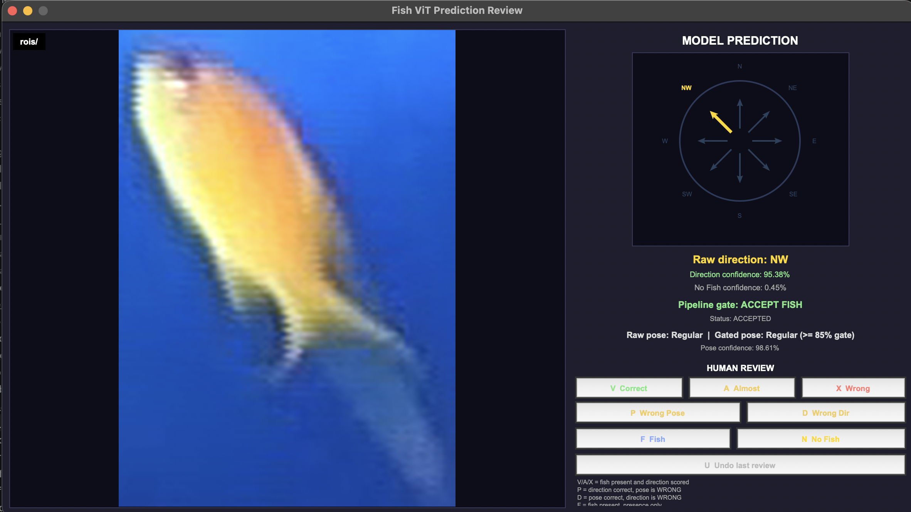

`evaluation/review_predictions_gui.py`, which scores a finished run on unseen
video where no ground truth exists. The badge in the top-left corner (`rois/`)
shows which pool the crop was drawn from — crops from
`rois_ignored_background/` are reviewed here too, since a fish the background
filter wrongly discarded is invisible to every other metric. The right pane
shows the model's raw call (NW at 95.38%, no-fish 0.45%), the pipeline's
accept/reject decision, and both the raw and gated pose with the 85% gate named
explicitly. The reviewer then presses one key: `V`/`A`/`X` for direction
correct / one 45° neighbour off / wrong, `P` or `D` for a
direction-right-pose-wrong mismatch and its reverse, `F`/`N` for presence only,
`U` to undo. Each keystroke writes one JSON into `<run>/reviews/`, which
`review_analysis.py` then turns into accuracy numbers.
